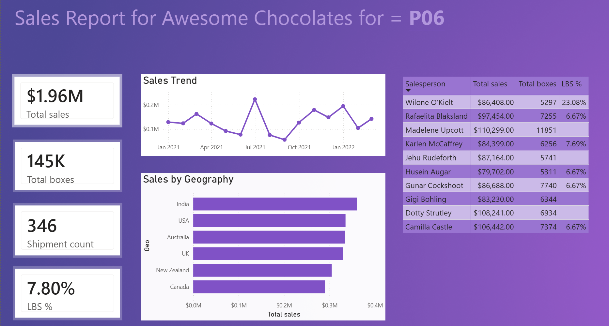
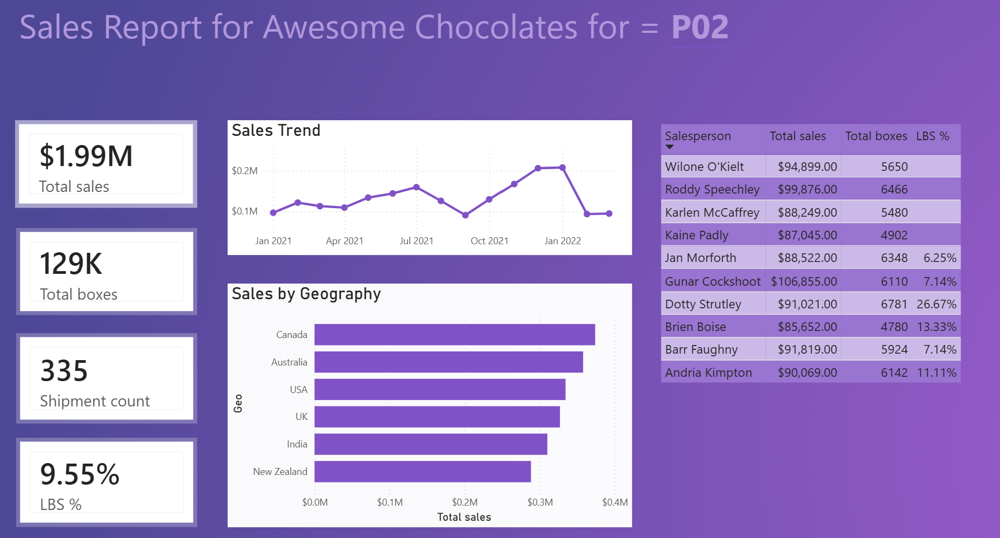
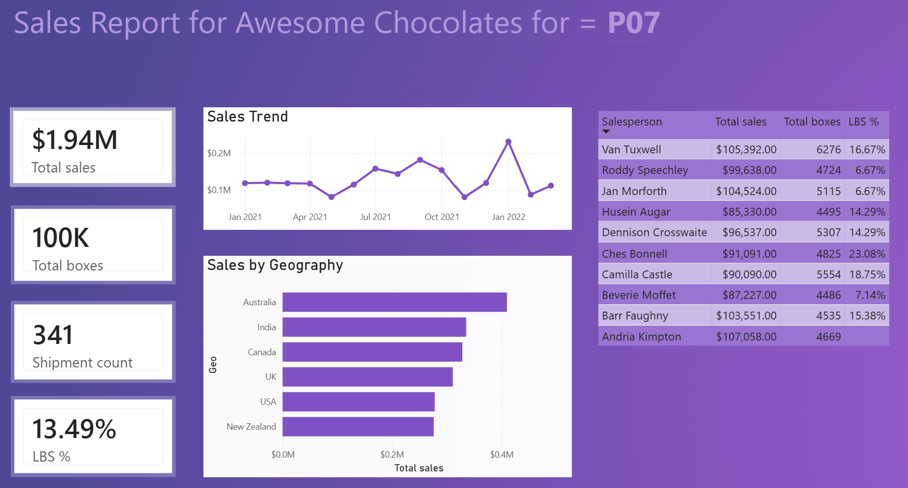

# Power BI Sales Dashboard — Awesome Chocolates



## Overview
This project demonstrates an end-to-end analytics workflow using **MySQL and Power BI**.  
A MySQL database was connected to Power BI to build an interactive sales dashboard with **DAX measures and parameterized queries**.

The dashboard supports dynamic filtering by **Product ID (PID)** using a Power Query parameter, automatically updating all visuals and metrics.


## Tech Stack

- Power BI Desktop
- MySQL
- Power Query (M)
- SQL
- DAX


## Dataset

Sample dataset: **Awesome Chocolates**

Tables used:
- `sales`
- `people`
- `geo`
- `products`


## Dashboard Features

### KPI Metrics
The following DAX measures were created:

- Total Sales
- Total Boxes
- Shipment Count
- Low Box Shipments
- LBS %

### Visualizations
The dashboard includes:

- KPI Cards
- Sales Trend (Line Chart)
- Sales by Geography (Bar Chart)
- Salesperson Performance Table


## Dynamic Query Parameterization

A **Power Query parameter (`Product Code`)** was created to dynamically filter the dataset by product.

Power Query implementation:

```powerquery
let
    Source = MySQL.Database("localhost:3306", "awesome chocolates"),
    Result = Value.NativeQuery(
        Source,
        "select * from sales where PID = @pid",
        [pid = #"Product Code"]
    )
in
    Result
```

Changing the parameter (e.g. `P02`, `P06`, `P07`) updates all dashboard visuals automatically.

Product: P02 


Product: P07



## Repository Structure

```
powerbi-awesome-chocolates-dashboard
│
├── powerbi
│   └── awesome_chocolates_dashboard.pbix
│
├── screenshots
│   └── dashboard_overview.png
│
└── README.md
```

## Setup Instructions

1. Import the `awesome_chocolates` dataset into MySQL.
2. Open `awesome_chocolates_dashboard.pbix` in Power BI Desktop.
3. Update the database connection if needed.
4. Modify the **Product Code parameter** to filter the dashboard by product.

## Future Improvements

- Add slicers for geography and salesperson
- Add time analysis (MoM / YoY)
- Deploy dashboard to Power BI Service
- Enable scheduled refresh

## Author

Analytics project exploring **Power BI, SQL, and dashboard development**.
